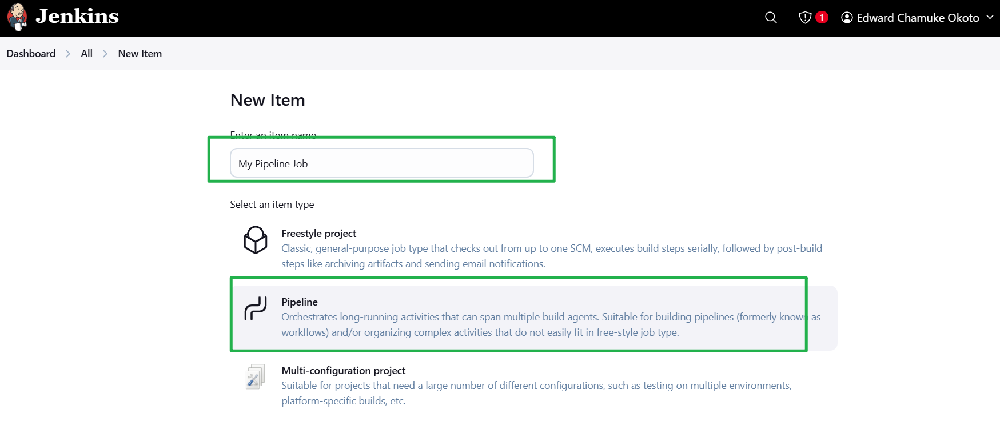
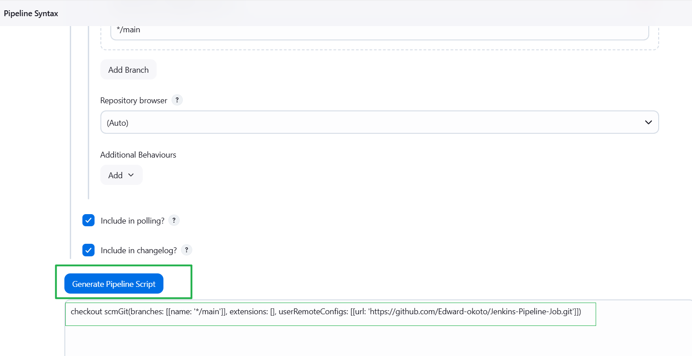

# Jenkins-Pipeline-Job

A Jenkins Pipeline Job is a powerful and flexible way to define and automate the continuous integration and continuous delivery (CI/CD) process as code in Jenkins.Jenkins Pipeline Jobs offer a robust and flexible way to automate the entire CI/CD process, enabling teams to deliver software more efficiently and reliably. By defining your pipeline as code, you can leverage the full power of version control, automation, and collaboration, ensuring a streamlined and effective development workflow.


### Creating a Pipeline Job

i. Click on New Item from the dashboard of the jenkins server.


ii. Create a pipeline job and name it My-Pipeline-Job or any desired name and click ok.



### Configuring Build Triggers for the pipeline Job

Click on the github repository

Click on settings and Webhook on the left hand side.

Click add webhook,add the jenkins server ip address and port and the extenstion `git-webhook`

click add webhook


iii.Click configure and add thise build triggers .Check the "GitHub hook trigger for GITScm polling"

Apply and Save


### Writing Jenkins Pipeline Script

A Jenkins Pipeline Script is a code-based way to define your Continuous Integration/Continuous Delivery (CI/CD) pipeline using Jenkins. It allows you to automate your build, test, and deployment processes as code. Jenkins Pipeline scripts are written using a domain-specific language (DSL) based on Groovy. There are two main types of Jenkins Pipeline scripts, Declarative and scripted.Jenkins Pipeline scripts are a powerful way to define and automate your CI/CD processes, enabling you to deliver software more efficiently and reliably. Whether you choose the simpler Declarative Pipeline or the more flexible Scripted Pipeline, you can customize your pipeline to fit your project's needs.


```groovy
pipeline {
    agent any

    stages {
        stage('Connect To GitHub') {
            steps {
                checkout scmGit(branches: [[name: '*/main']], extensions: [], userRemoteConfigs: [[url: 'https://github.com/Edward-okoto/Jenkins-Pipeline-Job.git']])
            }
        }
        stage('Build Docker Image') {
            steps {
                script {
                    sh 'docker build -t dockerfile .'
                }
            }
        }
        stage('Run Docker Container') {
            steps {
                script {
                    sh 'docker run -itd -p 8081:80 dockerfile'
                }
            }
        }
    }
}
```

### Explanation

- **pipeline { ... }**: Defines the pipeline.
- **agent any**: Specifies that the pipeline can run on any available Jenkins agent.
- **stages { ... }**: Groups the various stages of the pipeline.
- **stage('Connect To GitHub') { ... }**: The stage where the repository is cloned from GitHub.
- **checkout scmGit { ... }**: Uses the Git plugin to clone the specified branch of the repository.
- **stage('Build Docker Image') { ... }**: The stage where the Docker image is built.
- **sh 'docker build -t dockerfile .'**: Runs a shell command to build the Docker image with the tag "dockerfile".
- **stage('Run Docker Container') { ... }**: The stage where the Docker container is run.
- **sh 'docker run -itd -p 8081:80 dockerfile'**: Runs a shell command to start the Docker container, mapping port 8081 on the host to port 80 on the container.

iv. Copy the pipeline script above and past it in the section below.


Stage 1 of the script connect jenkins to github repository.To generate syntax for your repository,follow the steps below.

i.Click on the pipeline syntax.


ii. Select the drop down to search for `checkout: Check out from version control`


iii.Paste your repository url and make sure your branch is main.


iv.Generate your pipeline syntax.



Now you can replace your generated script for connecting jeckins with github.

### Installing Docker

Before Jenkins can run docker commands,we need to install docker on the same instance Jenkins was installed.

i.Create a file names docker.sh on the jenkins instance.

ii.Open the file and paste the script below.

```bash
#!/bin/bash

# Update package list and install prerequisites
sudo apt-get update -y
sudo apt-get install -y ca-certificates curl gnupg

# Set up the Docker keyrings directory and add Docker's official GPG key
sudo install -m 0755 -d /etc/apt/keyrings
curl -fsSL https://download.docker.com/linux/ubuntu/gpg | sudo gpg --dearmor -o /etc/apt/keyrings/docker.gpg
sudo chmod a+r /etc/apt/keyrings/docker.gpg

# Add Docker's official repository to Apt sources
echo \
  "deb [arch=$(dpkg --print-architecture) signed-by=/etc/apt/keyrings/docker.gpg] https://download.docker.com/linux/ubuntu \
  $(. /etc/os-release && echo "$VERSION_CODENAME") stable" | \
  sudo tee /etc/apt/sources.list.d/docker.list > /dev/null

# Update package list again to include Docker packages
sudo apt-get update -y

# Install Docker Engine and associated components
sudo apt-get install -y docker-ce docker-ce-cli containerd.io docker-buildx-plugin docker-compose-plugin

# Check the status of the Docker service
sudo systemctl status docker
```


iii.Save and close the file.

iv.make the file executable.

    chmod u+x docker.sh

v.Execute the file

    ./docker.sh


we have successfully installed DOCKER.

### Building Pipeline Script

Now that we have docker installed on the same instance as jenkins,we need to create a docker file before we can run our pipeline script.We cannot build a docker image without a docker file.

i. Create a dockerfile and paste this below.


```Dockerfile
# Use the official NGINX base image
FROM nginx:latest

# Set the working directory in the container
WORKDIR /usr/share/nginx/html/

# Copy the local HTML file to the NGINX default public directory
COPY index.html /usr/share/nginx/html/

# Expose port 80 to allow external access
EXPOSE 80
```

ii.Create an index file and paste the content below

    Congratulations, You have successfully run your first pipeline code.

Pushing these files dockerfile and index.html will trigger jenkins to automatically run new build for our pipeline.


